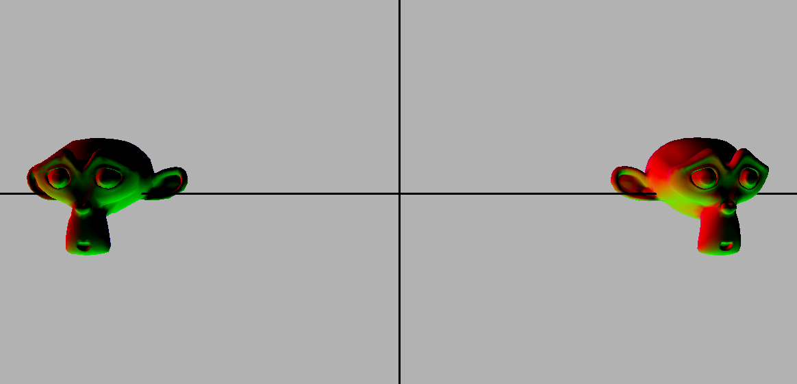
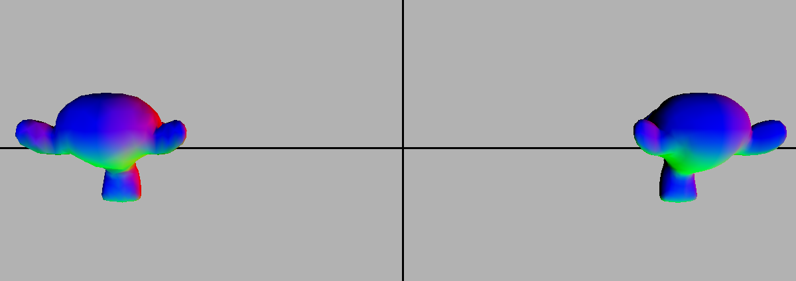
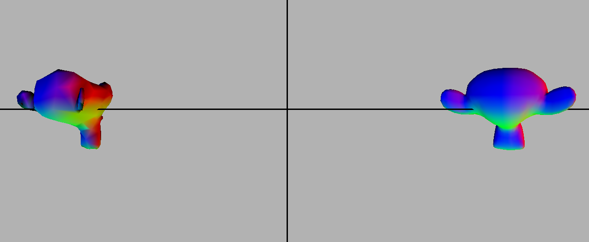
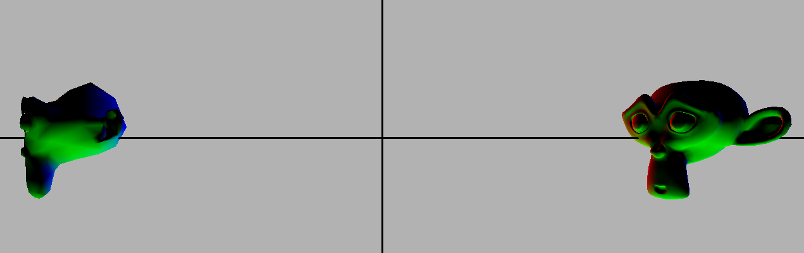
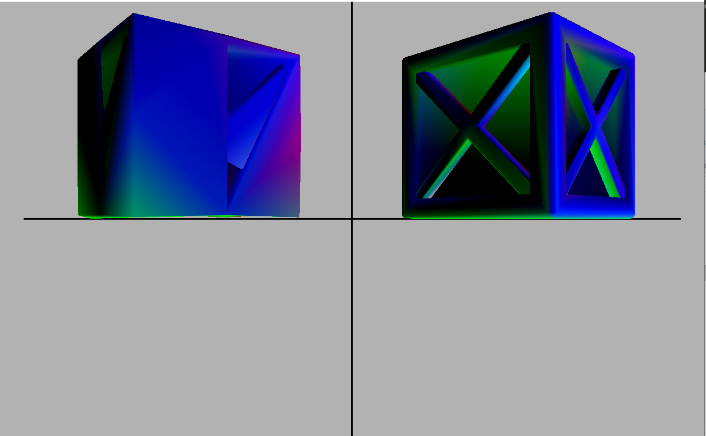

# MeshSimplification
Implementation of Surface Simplification Using QEM in C++.

## Project structure:

### engine
*This is the under-the-hood part that enables rendering meshes, our actual mesh  simplification is in here.*
- mesh.cpp
  - *Mesh represention via openGL.*
- shader.cpp
  - *Shader manager, with the ability to load and bind multiple textures.*
- obj_lodaer.cpp
  - *.obj File parser.*

### MeshSimplification
*Run specific simplification scene.*
- main.cpp
  - *Entry point.*
 
 ### display
*Window and input handler.*
- display.cpp
  - *Widndow wwith glfw wrapper.*
- inputManager.h
  - *User input handler.*
  
##  Code Flow
1.  main.cpp : Call the scene with the obj path, position and if to simplify. -->
2.  scene.cpp : Create the shape and add it to the scene to be drawn.
3.  shape.cpp : Create a mesh and texture for this shape.
4.  mesh.cpp : Create an OBJModel from the obj file and init the msh with it.
5.  obj_loader.cpp : Parse the file into an OBJModel with uvs, normal..etc.
6.  MeshSimplification.cpp : If we need to simplify this OBJModel, simplify it.

## Data structures
- m_edgeVector - vector of all edges (no order);
-	m_vertexNeighbor - multimap from vertex index to all it's neighbors;
- m_errors - vector of mat4 errors for every vertex index;
-	m_OBJIndices - list of OBJIndex, the final structure includes every normal, uv and vertex index in the vertices.
- m_vertices - vector of the positions of the vertices;
- At runtime create a min heap for the edges and update it on every edge removed.

##  Images:
> 4K trianlges on the right, 2k on the left.

> 4K trianlges on the right, 500 on the left.

> 298 trianlges on the right, 75 on the left.

